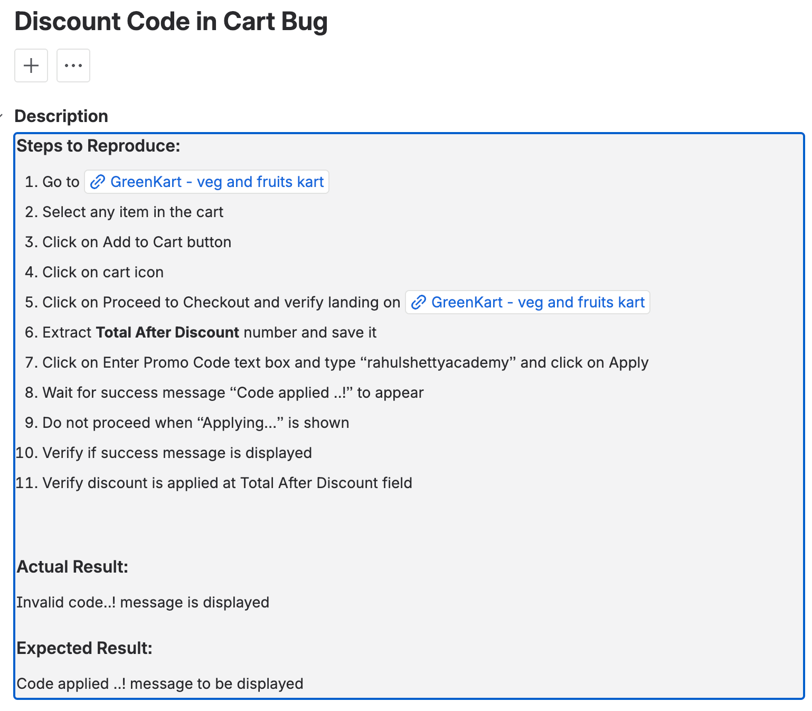

# Agentic AI Learning

A collection of agent-based AI examples and utilities demonstrating various patterns and use cases for autonomous
agents.

## Project Structure

```
agenticAI/
├── src/                          # Source code package
│   └── agentic_ai/               # Main package
│       └── __init__.py
├── examples/                     # Example scripts demonstrating different concepts
│   ├── __init__.py
│   ├── text_messaging.py         # Basic text-based agent interaction
│   ├── multimodal_messaging.py   # Agent with image processing capabilities
│   ├── round_robin_agents.py     # Multiple agents working in sequence
│   ├── round_robin_with_human.py # Human-in-the-loop agent interactions
│   ├── state_saving.py           # Persistent state management
│   ├── selector_group_chat.py    # Dynamic agent selection
│   ├── multimodal_web_surfer.py  # Web automation with multimodal input
│   ├── tooling_example.py        # Tool-using agents
│   └── jira_scenario.py          # JIRA integration example
├── tests/                        # Test files (to be added)
├── docs/                         # Documentation
├── assets/                       # Static assets
│   ├── images/                   # Image files
│   └── prompts/                  # System prompt files
├── data/                         # Data files and outputs
├── requirements.txt              # Python dependencies
├── pyproject.toml               # Modern Python project configuration
└── README.md                    # This file
```

## Installation

1. Clone the repository:

```bash
git clone <repository-url>
cd agenticAI
```

2. Create a virtual environment:

```bash
python -m venv .venv
source .venv/bin/activate  # On Windows: .venv\Scripts\activate
```

3. Install dependencies:

```bash
pip install -r requirements.txt
# or for development
pip install -e ".[dev]"
```

## Configuration

1. Copy `.env.example` to `.env` and fill in your API keys:

```bash
cp .env.example .env
```

2. Required environment variables:
    - `ANTHROPIC_API_KEY`: Your Anthropic API key
    - For JIRA examples: `JIRA_URL`, `JIRA_USERNAME`, `JIRA_API_TOKEN`

## Usage

### Running Examples

Each example can be run independently from the project root:

```bash
# Basic text messaging
python examples/text_messaging.py

# Multimodal messaging with images
python examples/multimodal_messaging.py

# Round-robin agent conversation
python examples/round_robin_agents.py

# JIRA integration (requires JIRA credentials)
python examples/jira_scenario.py
```

### Example Descriptions

- **text_messaging.py**: Demonstrates basic agent-user text interaction
- **multimodal_messaging.py**: Shows how to process images with agents
- **round_robin_agents.py**: Multiple agents collaborating in sequence
- **round_robin_with_human.py**: Human-in-the-loop agent workflows
- **state_saving.py**: Persistent conversation state management
- **selector_group_chat.py**: Dynamic agent selection based on context
- **multimodal_web_surfer.py**: Web automation with multimodal capabilities
- **tooling_example.py**: Agents that can use external tools
- **jira_scenario.py**: Real-world JIRA integration for bug analysis

## Development

### Screenshots

- These screenshots are pulled from my JIRA Cloud. This is purely for reference and not intended to demonstrate how bugs
  are to be created
  
- I have limited the number of bugs created strictly to 1 so as to not waste my API credits.

### Code Style

This project follows Python best practices:

- Snake case naming for files and variables
- Proper package structure with `__init__.py` files
- Type hints where appropriate
- Comprehensive docstrings

### Adding New Examples

1. Create new files in the `examples/` directory
2. Follow the naming convention: `descriptive_name.py`
3. Include proper imports and error handling
4. Add documentation and usage examples

## Contributing

1. Follow the existing code style
2. Add tests for new functionality
3. Update documentation as needed
4. Submit pull requests for review

## License

MIT License - see LICENSE file for details.
